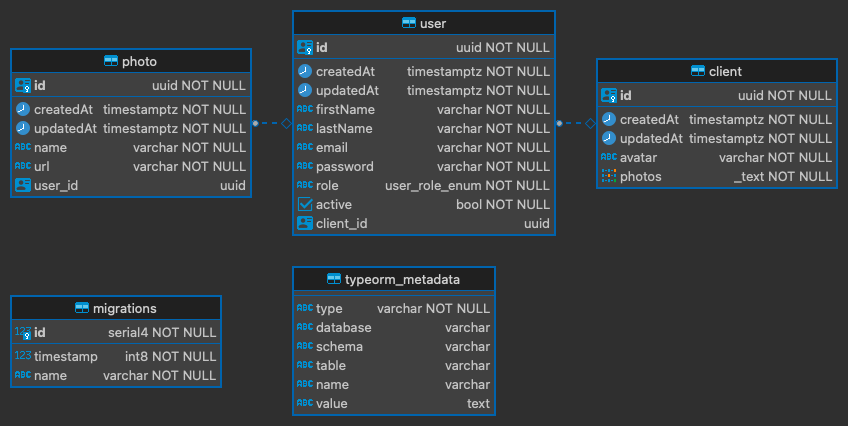

[](https://badge.fury.io/js/nestjs)
[](https://opensource.org/licenses/MIT)

## Table of Contents

- [Introduction](#introduction)
- [Getting Started](#features-implemented)
- [API Endpoints](#api-endpoints)
- [Author](#author)

# Introduction

The API provides a platform for user registration and client management. Users (client) can register with the system and retrieve their data when authenticated. The system ensures that the provided information meets specific criteria.

I implemented a domain-driven design approach to structure the project codebase, aligning business logic with distinct domains.


### Project Structure

```bash
├── src
├── .env.sample
├── .eslintrc
├── .gitignore
├── .prettierrc
├── jest.config
├── Makefile
├── package.json
├── README.md
└── tsconfig.json
```

### User Registration

- **Endpoint:** `/api/v1/auth/register`
- **Method:** `POST`
- **Request Payload:**
  - `firstName`: First name of the user (2 to 25 characters).
  - `lastName`: Last name of the user (2 to 25 characters).
  - `email`: Email address of the user (must be a valid email format).
  - `password`: User password (6 to 50 characters, must contain at least one number).
  - `role` (optional): User role, either 'Admin' or 'Client'. Defaults to 'Client'.
  - `photos`: photo(s) that clients upload which is stored in AWS s3 bucket.

### User Login

- **Endpoint:** `/api/v1/auth/login`
- **Method:** `POST`
- **Request Payload:**
  - `email`: Email address of the user (must be a valid email format).
  - `password`: User password (6 to 50 characters, must contain at least one number).
- **Response:** Returns a JWT token that can be used to authenticate future requests.

  ### Client Management

Registered users are categorized as clients, and each client has additional details:

- **Client Entity:**
  - `Avatar`: URL of the client's avatar (default provided).
  - `Photos`: Array of photos associated with the client.

### Photo Entity

Each photo is associated with a user (client) and includes details such as the name and URL.

### Relationships

- `User` and `Client`: One-to-One relationship.
- `User` and `Photo`: One-to-Many relationship.

### User Authentication

Authenticated clients can retrieve their own data:

- **Endpoint:** `/api/v1/client/user/me`
- **Method:** `GET`
- **Authentication:** JWT (JSON Web Token)
- **Response:** Returns details of the authenticated client, including avatar, photos, and other relevant information.


### Entity Relationship Diagram(ER)

- 


# Getting Started

### Dependencies

This project uses [Nest.js](https://docs.nestjs.com/) v10.0.0. It has the following dependencies:

[Postgres Database](https://www.postgresql.org/)
- [Typeorm](https://typeorm.io/)
- ESLint & Prettier

#### _Prerequisites_

- Ensure you have **NodeJS** installed by entering `node -v` on your terminal
  If you don't have **NodeJS** installed, go to the [NodeJS Website](http://nodejs.org), and follow the download instructions

### Getting the Source

### Installation and Running the Application

- After cloning the repository, create a `.env` file from `.env.sample` and set your local `.env.` variable(s).

```sh
cp .env.sample .env
```

### Usage

1. **User Registration:**
   - Users can register by making a `POST` request to the `/api/v1/auth/register` endpoint.
   - Provide the required information in the request payload.
   - The system validates the input and creates a new user.

2. **User Login:**
   - Users can login by making a `POST` request to the `/api/v1/auth/login` endpoint.
   - Provide the required information in the request payload.
   - The system validates the input and login the user (client).

3. **Client Details:**
   - Upon successful registration, a user is automatically associated with a client.
   - Clients have an avatar and can upload multiple photos.
   - Photos are associated with the client who uploaded them.

4. **User Authentication:**
   - Authenticated clients can use the `/api/v1/client/user/me` endpoint to retrieve their own data.


### Using the Makefile for Testing
How to run all tests locally

1. `make install` - Installs dependencies.
2. `make dev` - Run the server
3. `make build` - Run build to generate dist folder
4. `make lint` - Lint code


## _API Endpoints_

- Swagger documentation can be accessed on this localhost link [Swagger Docs Link](http://localhost:3500/api/v1/docs)

- Postman documentation is available on [Postman Docs](https://documenter.getpostman.com/view/7775892/2s9YRGwoCa)


### HTTP Response Codes

Each response will be returned with one of the following HTTP status codes:

- `200` `OK` The request was successful
- `201` `New Resource` The request was successful and created a new resource
- `400` `Bad Request` There was a problem with the request (security, malformed)
- `401` `Unauthorized` There was a problem with the request (security, malformed)
- `404` `Not Found` An attempt was made to access a resource that does not exist in the API
- `500` `Server Error` An error on the server occurred

# Technologies Used:

Nestjs, Postgres, Typeorm, Swagger, AWS S3, Postman

# Why Nestjs was used for the project

- `TypeScript Support`:

It is built with TypeScript, which brings the benefits of static typing, interfaces, and a more robust development experience. This helps catch errors during development rather than runtime.

- `Modular Architecture`:

It promotes a modular and organized code structure. It uses domain/modules, controllers, and services to separate concerns, making the codebase more maintainable and scalable.

- `Dependency Injection`:

NestJS uses a powerful dependency injection system that facilitates the development of loosely coupled and easily testable components. This promotes a clean and modular codebase.

- `ORM Integration`:

NestJS seamlessly integrates with popular Object-Relational Mapping (ORM) libraries like TypeORM. This simplifies database operations and allows developers to work with databases using TypeScript.

- `Scalability`:

It is designed to be scalable, making it suitable for both small projects and large-scale enterprise applications. Its modular architecture and organization facilitate the growth of applications over time.


# Author 💥:

Francis Nnamdi Abonyi